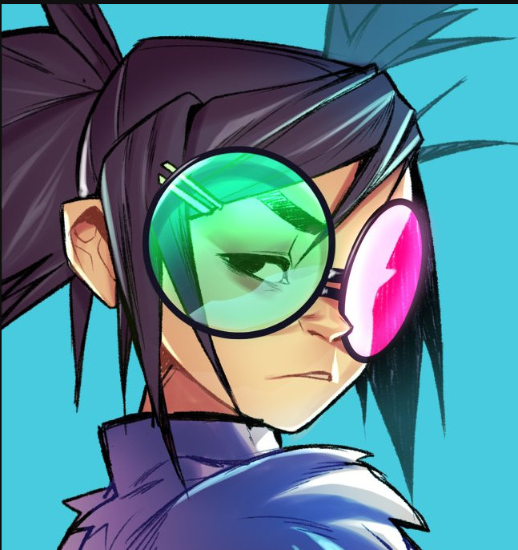

<h1 align="center" style="position: relative;">
    <br>
</h1>

<h2>
✨ Noodle ✨
</h2>

<p>
Noodle is a single purpose bot with the goal of image manipulation in mind. 
We created this bot when we needed to find a way to upload a png image as an animated emote to gif. 
We've created a method to work-around this system.  
</p>


<h3>
Behind the scenes
</h3>
<ul>
    <li>
        Logging
    </li>
    <li>
    Dependency Injection
    </li>
</ul>

<h3>
Setup
</h3>

Noodle requires [.NET 5](https://dotnet.microsoft.com/download/dotnet/5.0) to compile and run.

As of right now the bot comes with a basic `appsettings.json` that allows you to configure your token and prefix

```
{
   "token": "token",
   "prefix": "!",
}
```
